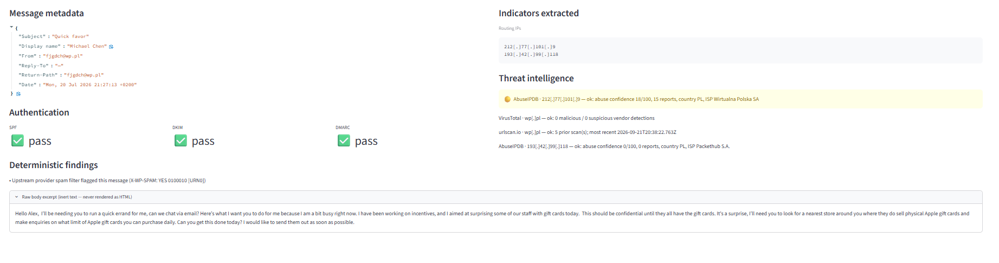
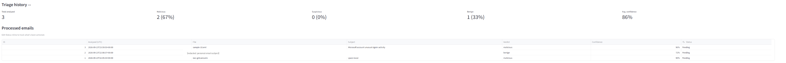
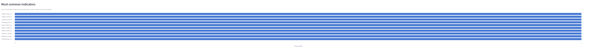

# Phishing Triage

Upload a raw `.eml` file and get an analyst-ready phishing verdict. Deterministic
checks extract the evidence; Claude synthesizes it into a verdict, confidence
score, indicator list, and recommended action.


A gift-card BEC message that passes SPF, DKIM, and DMARC, correctly flagged malicious from content alone.



Authentication passes cleanly and every threat-intel lookup comes back clean — the verdict rests entirely on what the message asks the recipient to do.

## How it works

1. **Parse** (`email_parser.py`) — pulls SPF/DKIM/DMARC results, sender/display-name
   inconsistencies, links (including anchor-text mismatches, URL shorteners, and
   mailto: links), hidden tracking pixels, risky attachments, malformed/evasive
   From headers, upstream spam-filter verdicts, and hashbusting/Bayesian-poisoning
   filler text — all as deterministic, code-driven findings.
2. **Enrich** (`enrich.py`) — looks up extracted domains and IPs against
   VirusTotal, urlscan.io, and AbuseIPDB, concurrently and with retry-on-timeout.
   Results with only a couple of stray vendor hits are reported as low-confidence
   noise rather than treated as real detections.
3. **Verdict** (`verdict.py`) — sends Claude the deterministic findings and
   enrichment results, plus the plain-text body (capped at 8,000 characters)
   inside a delimited block labeled as untrusted. The body is included on
   purpose: business email compromise often passes every header check and is
   detectable only from what the message asks the recipient to do. Claude
   can respond only through a single forced tool call, `record_verdict`, which
   returns a structured verdict (`benign` / `suspicious` / `malicious`),
   confidence, cited indicators, and a recommended action.
4. **Display** (`app.py`) — a Streamlit front end that renders everything,
   including defanged/inert indicators so nothing is ever clickable or rendered
   as live HTML.

## Safety properties

- The email body is only ever rendered as plain text (`st.code`/`st.text`),
  never as HTML — no attacker HTML/JS execution, no remote tracking pixels
  firing in your browser.
- No URL found in a message is ever fetched or visited by this tool.
- Attachments are hashed in memory only; nothing is written to disk.
- The email body is treated as untrusted, attacker-controlled data in the
  prompt sent to Claude. It is wrapped in `<email_body>` delimiters, any
  delimiter tags the attacker writes into the message are stripped first so
  the block cannot be closed early, and the system prompt instructs the model
  to analyze embedded instructions rather than follow them.
- The model has no tools that act on the world. Its only tool records a
  verdict; it cannot fetch URLs, send mail, or block anything. The analyst
  makes the decision.
- Model output is rendered as plain text, not markdown, because it quotes
  attacker-written text. A link or address quoted from the email cannot
  become clickable in the UI.

## Threat model and framework mapping

The design choices above map onto the OWASP Top 10 for LLM Applications (2025):

| Risk | Mitigation in this tool |
| --- | --- |
| LLM01 Prompt Injection (indirect, via the email body) | Delimited untrusted-data block; attacker-written delimiters stripped; explicit do-not-follow rule; output constrained to a fixed schema with an enum verdict |
| LLM05 Improper Output Handling | Model output rendered as plain text; stray markup stripped from every field before display |
| LLM06 Excessive Agency | One forced tool with no side effects; no URL fetching, no automated response actions |
| LLM09 Misinformation | Each indicator must cite the observed value it rests on; strict rules on describing SPF/DKIM/DMARC results; deterministic findings displayed alongside the verdict so the analyst can check the model's work |
| LLM10 Unbounded Consumption | Body capped at 8,000 characters; bounded output tokens; enrichment capped at four domains and three IPs per message |

In MITRE ATLAS terms, the primary adversary technique considered is indirect
LLM prompt injection (AML.T0051.001): an attacker who expects their message
to be triaged by an LLM writes instructions to that model into the email.

## Limitations

- Prompt-level defenses reduce injection risk; they do not eliminate it. The
  forced schema limits what a successful injection could achieve (a wrong
  verdict, not an action), which is why the verdict is advisory and the
  analyst decides.
- The message body is sent to the Anthropic API. Only triage mail you are
  authorized to share with a third-party processor.
- Threat-intelligence lookups are capped to stay within free API tiers, so
  messages with many domains are only partially enriched.
- AbuseIPDB scores on large mail providers' shared relays reflect their other
  users. Scores below 50 are shown as low-confidence rather than detections.

## Setup

```bash
pip install -r requirements.txt
cp .env.example .env
```

Edit `.env` and fill in your own API keys:

```
VT_API_KEY=...          # https://www.virustotal.com/gui/my-apikey
ABUSEIPDB_API_KEY=...   # https://www.abuseipdb.com/account/api
URLSCAN_API_KEY=...     # https://urlscan.io/user/profile/
ANTHROPIC_API_KEY=...   # https://console.anthropic.com/settings/keys
```

Only `ANTHROPIC_API_KEY` is required for the verdict step. The others are
optional — omit them and the app just reports "no API key configured" for
that vendor instead of failing.

**Never commit `.env`** — it's already gitignored. `.env.example` should only
ever contain placeholder text.

## Run

```bash
streamlit run app.py
```

Upload a `.eml` file (in Gmail: **⋮ → Show original → Download Original**) and
the app will parse, enrich, and triage it.

## Dashboard

A second tab aggregates every triage result into a running history, persisted
locally in SQLite (`triage_history.db`, gitignored) so it survives restarts
rather than resetting each session.



Totals, verdict breakdown, and average confidence across every analyzed email, with an editable Status column (Pending / Reviewed / Escalated / False Positive) for tracking remediation.



The indicator strings most frequently cited across every verdict, surfacing recurring attack patterns rather than one-off findings.

## Test samples

`samples/` contains three fixtures:

- `benign-github.eml` — should always produce zero header findings.
- `phish-paypal.eml` — a spoofed PayPal phishing email with failed
  authentication, a sender/Return-Path mismatch, and a deceptive link; should
  always produce a full set of findings and a `malicious` verdict.
- `injection-bec.eml` — a gift-card BEC message that passes SPF, DKIM, and
  DMARC and contains a prompt-injection payload: it writes a closing
  `</email_body>` tag followed by fake "SYSTEM" instructions to record a
  benign verdict. The verdict should remain `malicious`, and the injection
  attempt should appear as an indicator.

```bash
python -c "from email_parser import parse_email; print(parse_email(open('samples/benign-github.eml','rb').read())['header_findings'])"
```

## Project structure

```
app.py            Streamlit front end (single-email triage + dashboard tabs)
email_parser.py   Deterministic .eml parsing and header/content analysis
enrich.py         VirusTotal / AbuseIPDB / urlscan.io lookups
verdict.py        Claude-based verdict synthesis
storage.py        SQLite-backed triage history and remediation status
samples/          Test fixtures (benign, phishing, prompt injection)
```

## License

MIT. See [LICENSE](LICENSE).
